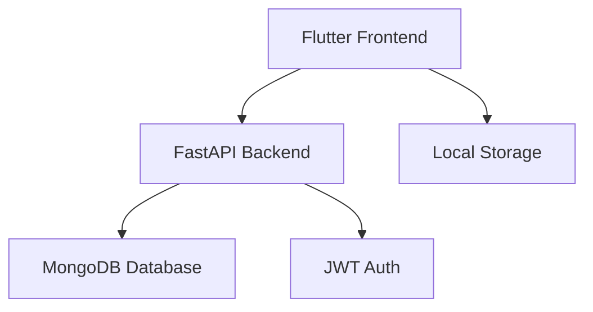

# ChillBills
### A Gamified Expense Tracking App
*Track expenses with fun and rewards*

---

# Problem Statement
- Traditional expense tracking is boring and tedious
- Users often forget to log expenses
- Lack of motivation to maintain financial discipline
- Need for an engaging way to track expenses

---

# Solution: ChillBills
A gamified expense tracking app that makes financial management fun and rewarding

## Key Features
- Easy expense logging with categories
- Visual insights and analytics
- Achievement system with rewards
- Monthly spending challenges
- Clean, intuitive UI

---

# App Workflow
1. User Registration/Login
2. Dashboard Overview
   - Recent Expenses
   - Monthly Summary
   - Achievement Progress
3. Add/Edit Expenses
4. View Insights
   - Category Breakdown
   - Spending Trends
   - Achievement Status

---

# Technical Architecture

## Tech Stack
- Frontend: Flutter
- Backend: FastAPI
- Database: MongoDB
- Authentication: JWT

---

# Core Features Demo
1. User Authentication
   - Secure login/registration
   - JWT token management

2. Expense Management
   - Add/Edit/Delete expenses
   - Category organization
   - Date tracking

3. Insights & Analytics
   - Category breakdown
   - Monthly trends
   - Visual charts

4. Gamification
   - Achievement system
   - Monthly challenges
   - Progress tracking

---

# Project Timeline
## Week 1: Core Features
- Basic UI setup
- Authentication
- Expense CRUD operations

## Week 2: Analytics & UI
- Dashboard implementation
- Insights & charts
- UI polish

## Week 3: Gamification
- Achievement system
- Monthly challenges
- Final testing & deployment

---

# Thank You!
## Questions?
