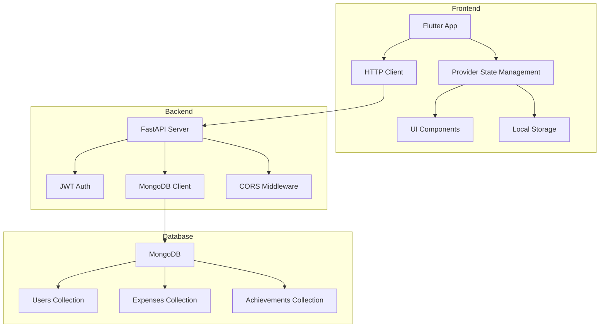
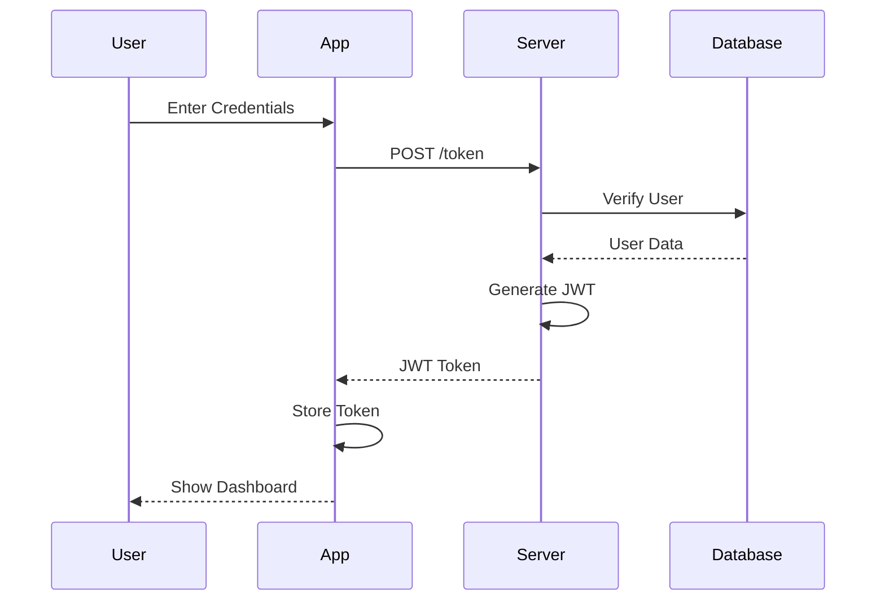
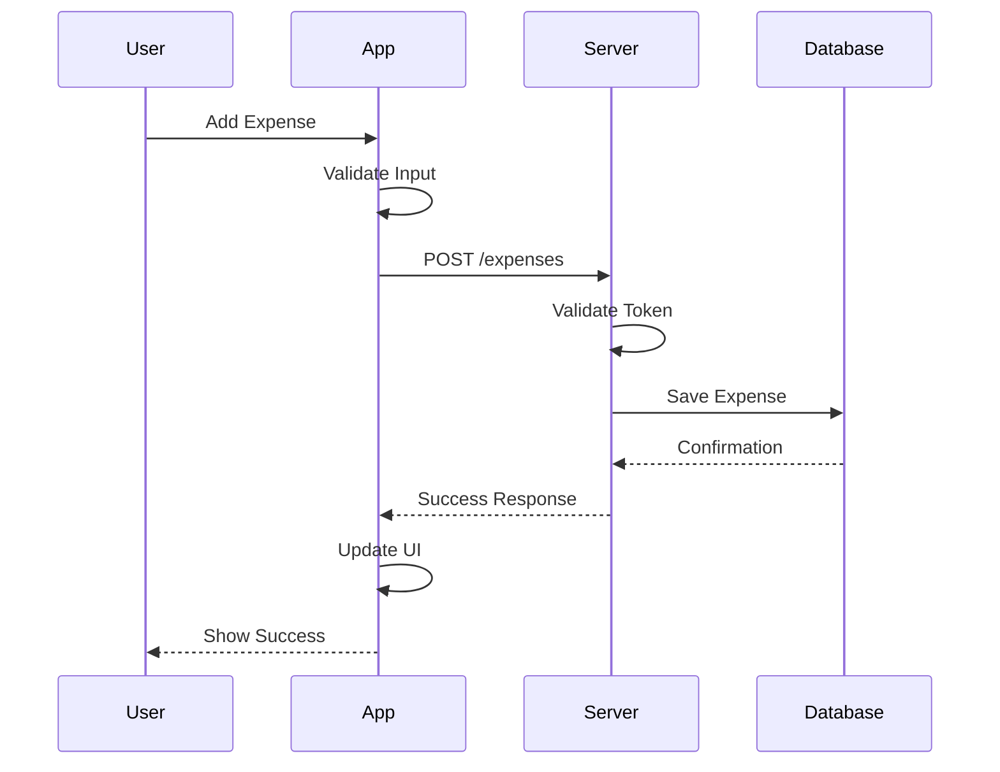
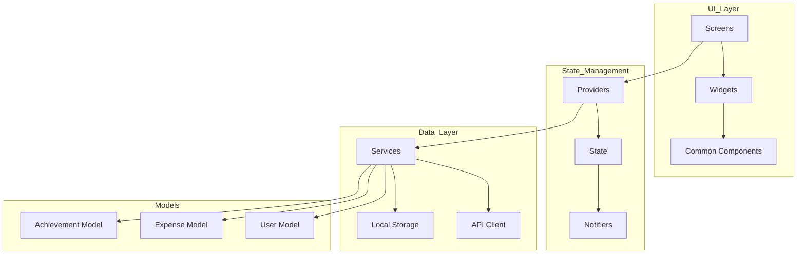
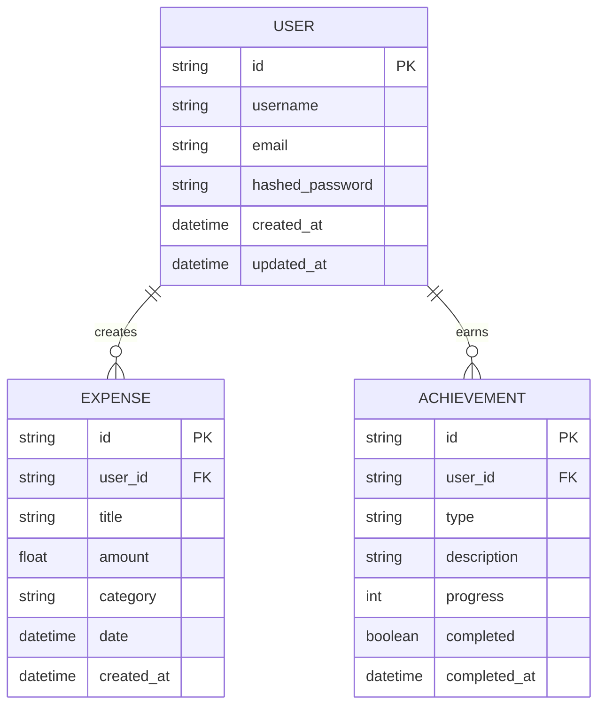
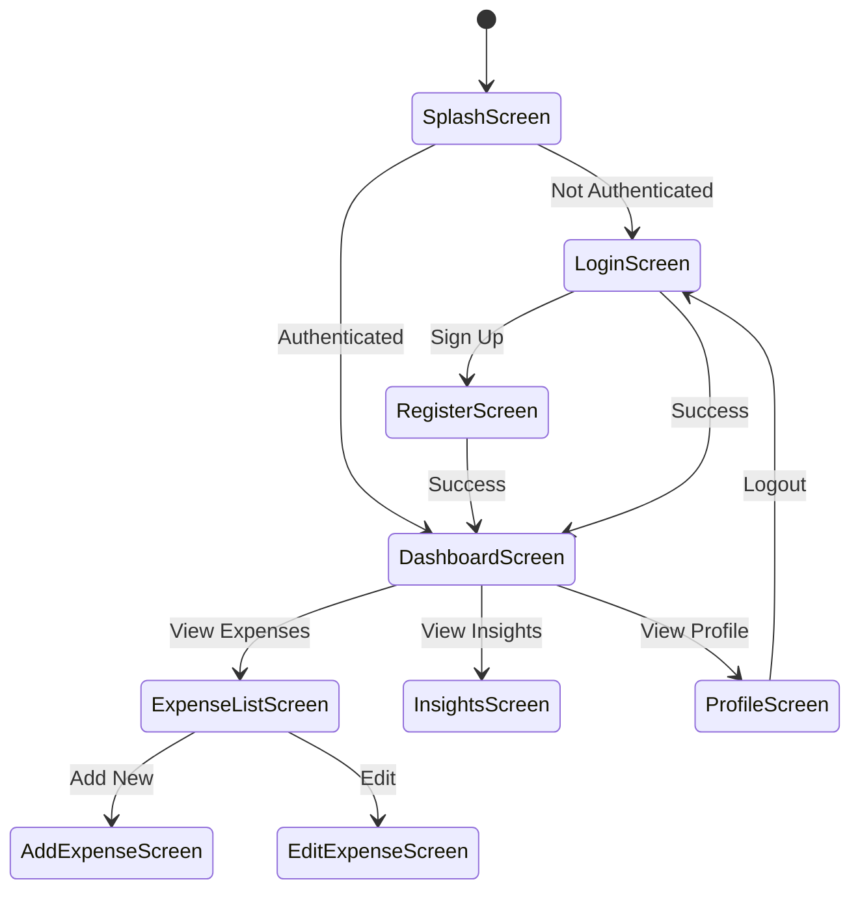
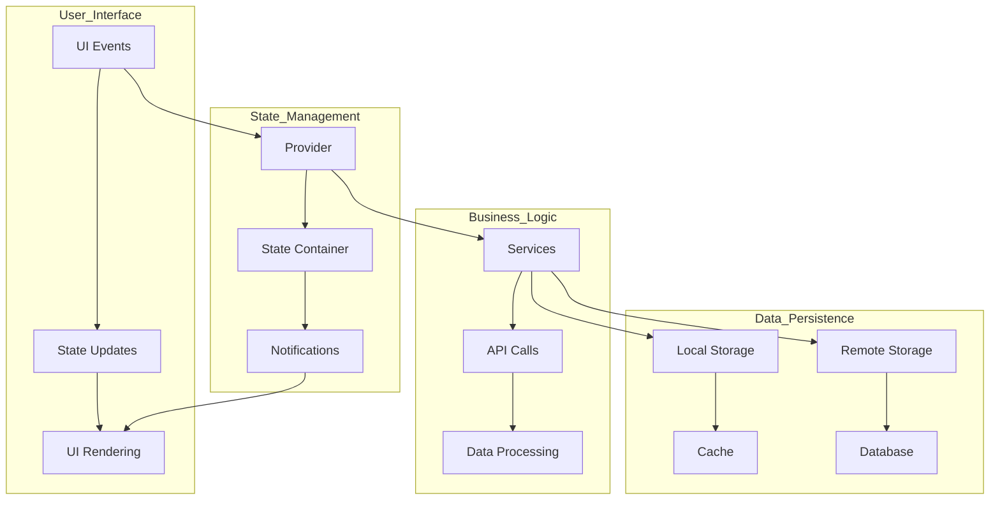
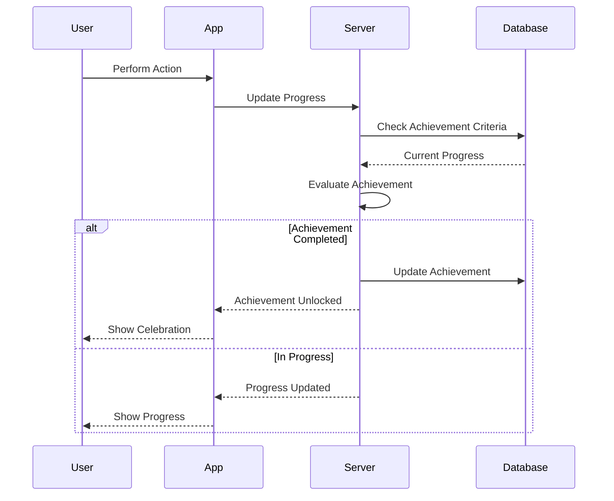
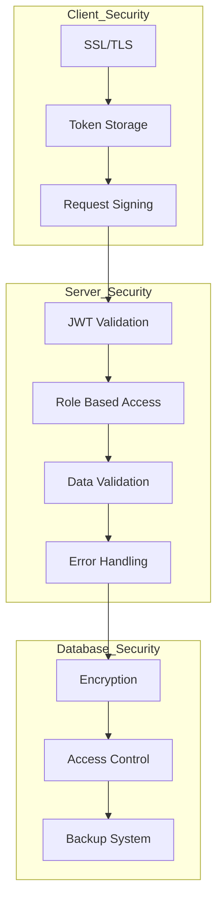

# ChillBills Design Diagrams

## System Architecture

## User Authentication Flow

## Expense Management Flow

## Component Architecture

## Database Schema

## Screen Navigation Flow

## Data Flow Architecture

## Achievement System Flow

## Security Architecture

