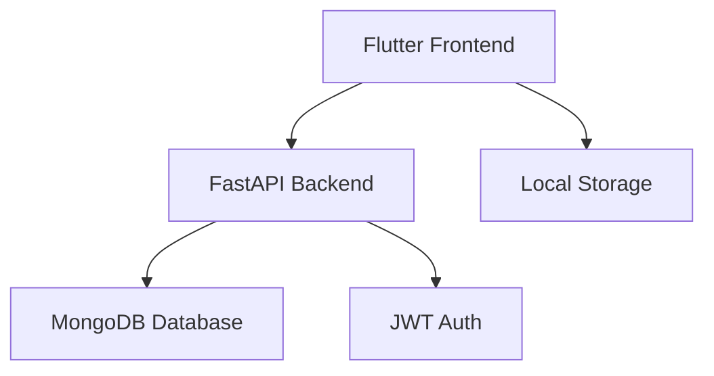

# ChillBills Technical Documentation

## Table of Contents
1. [Architecture Overview](#architecture-overview)
2. [Frontend Implementation](#frontend-implementation)
3. [Backend Implementation](#backend-implementation)
4. [Database Schema](#database-schema)
5. [API Documentation](#api-documentation)
6. [Authentication Flow](#authentication-flow)
7. [Code Structure](#code-structure)
8. [Testing Strategy](#testing-strategy)

## Architecture Overview

### System Architecture


### Key Components
1. **Frontend (Flutter)**
   - Material Design UI
   - Provider state management
   - Local storage
   - HTTP client

2. **Backend (FastAPI)**
   - RESTful API
   - JWT authentication
   - MongoDB integration
   - CORS middleware

3. **Database (MongoDB)**
   - User collection
   - Expenses collection
   - Achievements collection

## Frontend Implementation

### State Management
```dart
// Provider pattern for state management
class ExpenseProvider extends ChangeNotifier {
  final ApiService _apiService;
  List<Expense> _expenses = [];
  bool _isLoading = false;
  String? _error;

  Future<void> fetchExpenses() async {
    _isLoading = true;
    notifyListeners();

    try {
      _expenses = await _apiService.getExpenses();
      _error = null;
    } catch (e) {
      _error = e.toString();
    } finally {
      _isLoading = false;
      notifyListeners();
    }
  }
}
```

### UI Components
1. **Dashboard Screen**
   - Recent expenses list
   - Monthly summary
   - Quick actions

2. **Add/Edit Expense**
   - Form validation
   - Category selection
   - Date picker

3. **Analytics Screen**
   - Pie chart for categories
   - Line chart for trends
   - Summary cards

### Local Storage
```dart
class LocalStorage {
  static const String TOKEN_KEY = 'access_token';
  static const String USER_ID_KEY = 'user_id';

  Future<void> saveToken(String token) async {
    final prefs = await SharedPreferences.getInstance();
    await prefs.setString(TOKEN_KEY, token);
  }

  Future<String?> getToken() async {
    final prefs = await SharedPreferences.getInstance();
    return prefs.getString(TOKEN_KEY);
  }
}
```

## Backend Implementation

### API Routes
1. **Authentication**
   ```python
   @router.post("/token")
   async def login(form_data: OAuth2PasswordRequestForm):
       user = authenticate_user(form_data.username, form_data.password)
       access_token = create_access_token(user.id)
       return {"access_token": access_token, "token_type": "bearer"}
   ```

2. **Expenses**
   ```python
   @router.get("/expenses")
   async def get_expenses(current_user: User = Depends(get_current_user)):
       return await get_user_expenses(current_user.id)
   ```

### Authentication Middleware
```python
async def get_current_user(token: str = Depends(oauth2_scheme)):
    credentials_exception = HTTPException(
        status_code=401,
        detail="Could not validate credentials",
        headers={"WWW-Authenticate": "Bearer"},
    )
    try:
        payload = jwt.decode(token, SECRET_KEY, algorithms=[ALGORITHM])
        user_id: str = payload.get("sub")
        if user_id is None:
            raise credentials_exception
    except JWTError:
        raise credentials_exception
    
    user = await get_user(user_id)
    if user is None:
        raise credentials_exception
    return user
```

## Database Schema

### Users Collection
```json
{
  "_id": ObjectId,
  "username": String,
  "email": String,
  "hashed_password": String,
  "created_at": DateTime,
  "updated_at": DateTime
}
```

### Expenses Collection
```json
{
  "_id": ObjectId,
  "user_id": ObjectId,
  "title": String,
  "amount": Double,
  "category": String,
  "date": DateTime,
  "created_at": DateTime,
  "updated_at": DateTime
}
```

### Achievements Collection
```json
{
  "_id": ObjectId,
  "user_id": ObjectId,
  "type": String,
  "description": String,
  "progress": Int,
  "completed": Boolean,
  "completed_at": DateTime
}
```

## API Documentation

### Authentication Endpoints

#### POST /token
Login endpoint for user authentication
- Request:
  ```json
  {
    "username": "string",
    "password": "string"
  }
  ```
- Response:
  ```json
  {
    "access_token": "string",
    "token_type": "bearer"
  }
  ```

### Expense Endpoints

#### GET /expenses
Get all expenses for the authenticated user
- Headers:
  ```
  Authorization: Bearer {token}
  ```
- Response:
  ```json
  [
    {
      "id": "string",
      "title": "string",
      "amount": 0.0,
      "category": "string",
      "date": "2024-01-01T00:00:00Z"
    }
  ]
  ```

#### POST /expenses
Create a new expense
- Headers:
  ```
  Authorization: Bearer {token}
  ```
- Request:
  ```json
  {
    "title": "string",
    "amount": 0.0,
    "category": "string",
    "date": "2024-01-01T00:00:00Z"
  }
  ```

## Authentication Flow

1. **Registration**
   - User submits username, email, password
   - Password is hashed
   - User record created
   - JWT token generated and returned

2. **Login**
   - User submits credentials
   - Credentials verified
   - JWT token generated and returned
   - Token stored in local storage

3. **API Requests**
   - Token attached to request header
   - Server validates token
   - User identified from token
   - Request processed

## Code Structure

### Frontend Structure
```
lib/
├── main.dart
├── models/
│   ├── user.dart
│   └── expense.dart
├── providers/
│   ├── auth_provider.dart
│   └── expense_provider.dart
├── screens/
│   ├── auth/
│   ├── dashboard/
│   └── expenses/
├── services/
│   └── api_service.dart
└── widgets/
    └── common/
```

### Backend Structure
```
app/
├── main.py
├── models/
│   ├── user.py
│   └── expense.py
├── routes/
│   ├── auth.py
│   └── expenses.py
├── services/
│   └── database.py
└── utils/
    └── security.py
```

## Testing Strategy

### Frontend Tests

1. **Unit Tests**
   - Provider tests
   - Service tests
   - Model tests

2. **Widget Tests**
   - UI component tests
   - Form validation
   - Navigation

3. **Integration Tests**
   - End-to-end flows
   - API integration
   - State management

### Backend Tests

1. **Unit Tests**
   - Route handlers
   - Service functions
   - Utility functions

2. **Integration Tests**
   - Database operations
   - Authentication flow
   - API endpoints

3. **Performance Tests**
   - Load testing
   - Response times
   - Concurrent users
